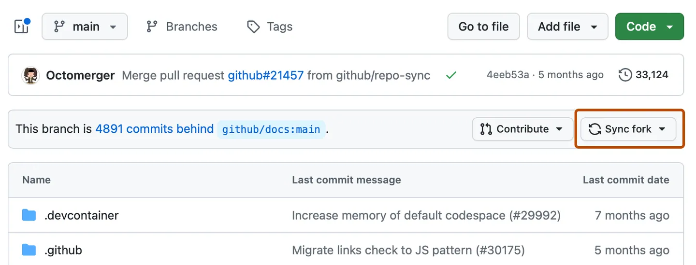

# 포크 동기화 가이드
포크한 저장소는 원본 저장소의 변경 사항을 자동으로 반영하지 않습니다.포크한 저장소는 별도로 동기화를 수행하지 않으면 뒤처져 충돌이 발생하게 됩니다. 이 문서는 포크한 저장소를 원본 저장소와 동기화하는 방법을 설명합니다.


# 웹 UI에서 포크 브랜치 동기화
---
1. GitHub에서 업스트림 저장소 (원본 저장소)와 포크된 저장소(내 저장소)로 페이지로 이동.
2. 파일 목록 상단에서 sync fork 선택.

3. 업스트림 저장소의 커밋에 대한 세부 정보 검토 후, 브랜치 업데이트를 클릭.


# GitHub CLI를 사용하여 포크 브랜치 동기화
--- 
```bash
gh repo sync owner/cli-fork -b BRANCH-NAME
```

- owner/cli-fork : 포크한 저장소의 경로 (소유자/저장소명 형식)
- -b BRANCH-NAME : 동기화할 대상 브랜치 이름

부모 포크에서 원격 포크를 업데이트하려면 gh repo sync -b BRANCH-NAME 명령을 사용해 포크와 브랜치 이름을 인수로 제공.


만약 업스트림의 변경 사항과 포크 저장소의 브랜치 간에 충돌이 발생하면, GitHub CLI는 자동으로 동기화를 수행하지 않음.
이 경우 --force 플래그를 사용해 포크 저장소의 해당 브랜치를 원본 저장소 기준으로 강제로 덮어쓸 수 있음.

```bash
gh repo sync owner/cli-fork -b BRANCH-NAME --force
```

주의: --force 옵션을 사용하면 로컬 또는 포크 저장소의 해당 브랜치에 있는 기존 커밋이 사라질 수 있음.


# 명령줄에서 포크 브랜치 동기화
--- 
포크를 업스트림 저장소와 동기화하려면 먼저 Git에서 업스트림 저장소를 가리키는 원격 저장소를 구성해야함.

1. Git Bash를 엶
2. 현재 작업 디렉토리를 로컬 프로젝트로 변경
3. 업스트림 저장소에서 브랜치와 해당 커밋을 가져옴
```bash
git fetch upstream
```
결과
```bash
upstream/BRANCH-NAME
```
커밋은 BRANCH-NAME로컬 브랜치에 저장
4. 포크의 로컬 기본 브랜치 확인
```bash
git checkout BRANCH-NAME
```
5. 업스트림 기본 브랜치의 변경 사항을 로컬 기본 브랜치에 병합
```bash
 git merge upstream/BRANCH-NAME
```
이렇게 하면 로컬 변경 사항을 잃지 않고 포크의 기본 브랜치가 업스트림 저장소와 동기화됨.


## [Syncing a fork 깃허브 공식 문서](https://docs.github.com/ko/pull-requests/collaborating-with-pull-requests/working-with-forks/syncing-a-fork)