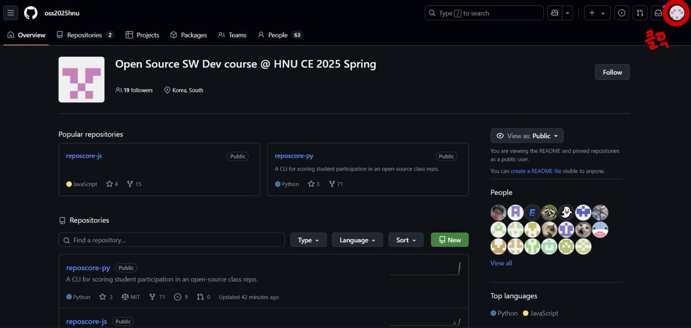
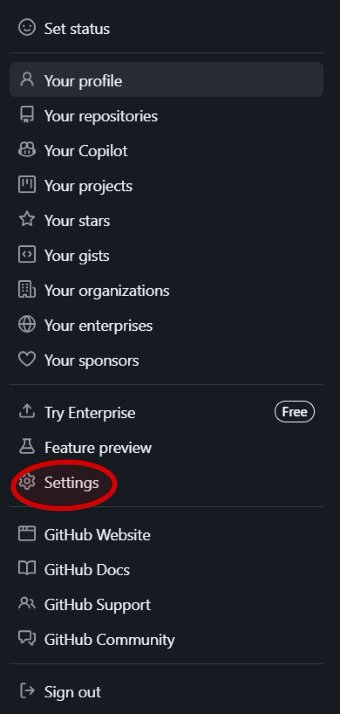
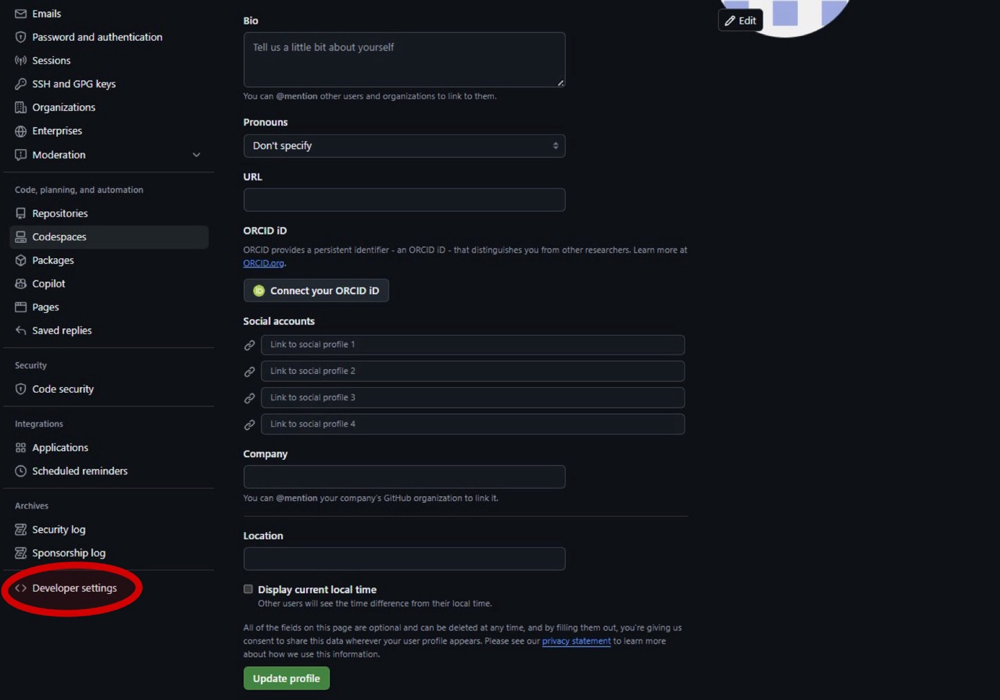
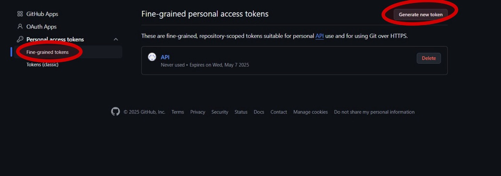
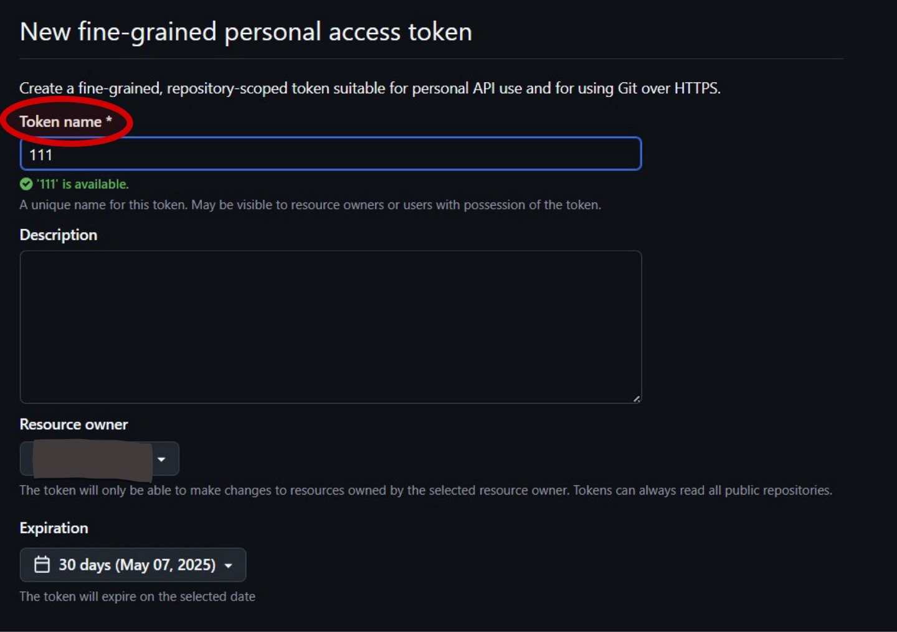
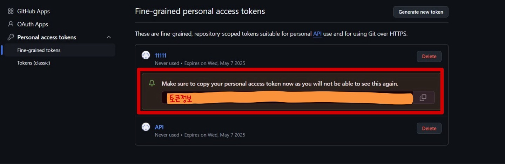

# GitHub Personal Access Token 발급 가이드 (이미지 포함)

GitHub API 제한을 피하고 private 저장소에 접근하려면 **Personal Access Token (PAT)** 을 사용해야 합니다.

## 1. GitHub에 로그인 후 우측 상단 프로필 클릭 



---

## 2. `Settings` 선택



---

## 3. 좌측 사이드바에서 `Developer settings` 선택



---

## 4.  `Personal access tokens` → `Fine-grained tokens` 클릭 -> 기존 토큰 확인 또는 `Generate new token` 클릭



---

## 5. 토큰 이름과 만료일을 설정하고 `Generate token`을 눌러 생성



---

## 6. ⚠️ 주의:** 토큰은 **한 번만** 보여지므로 반드시 안전한 곳에 복사해두세요.




---

## 7. 생성된 토큰을 복사하고 CLI에 아래처럼 사용

```
$ node index.js -a 토큰 -r oss2025hnu/reposcore-js
```
